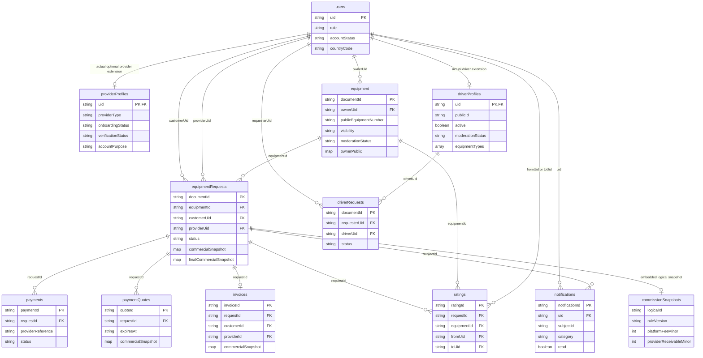

# Heavyar mobile operational reliability and scalability audit

## Scope, baseline, and evidence labels

This document owns Parts I–R of the mobile reliability phase. It intentionally
does not change application source, Firestore Rules, Firestore indexes, pricing,
commission logic, payments, iOS, or deployment.

- Canonical nested checkout: `.local/early-access-app`
- Audited baseline: Git `188cb2d8e43dd42199ebe78c2193c23b4cc50201`
- Primary source areas: `artifacts/heavyar-mobile/app`, `components`,
  `contexts`, `services`, `worker/src`, `firestore.rules`, and
  `firestore.indexes.json`
- **Code-derived** means an upper bound inferred from source, not billing data.
- **Measured** means produced by an executed test against an identified target.
- No production traffic was generated for this audit.

The mobile screen-bound helper and discovery helper are changing the source in
parallel. Tables headed **baseline** describe the SHA above. The final-budget
table is the acceptance target and must be reconciled against their final source
before release.

## Executive launch blockers

At the baseline, ordinary mobile use has multiple unbounded paths:

1. Home/Search public equipment reads the entire eligible collection.
2. Requests subscribes to all requests and renders an equipment `getDoc` per
   row (an N+1).
3. Provider My Equipment and the Provider Profile equipment summary query all
   equipment owned by the provider.
4. Chat subscribes to the complete messages subcollection.
5. Invoices and the ratings helper query complete matching collections.
6. Driver Search and Driver Profile run 15-second focus polling; Driver Search
   refetches every page already loaded.

Items 1–6 must be bounded/removed before public launch. Helpers own those source
changes. Worker Driver Search has since been reduced from the baseline multi-page
scan to one query of at most 100 profiles and one account `batchGet` of at most
100 users. Policy and country configuration are each read once. This remains a
high but explicit finite budget and should eventually use a maintained public
projection.

### Integrated working-tree reconciliation

The helper changes became visible while this report was being prepared. The
current working tree now resolves most baseline blockers:

- requests listener/query pages are 20, and each page fetches unique equipment
  IDs in one `in` query for the normal 20-row page (the helper supports batches
  of 30); there is no per-card `getDoc`;
- owner equipment, invoices, and ratings are cursor-paged at 20;
- chat listens to the newest 50 and pages older messages 50 at a time;
- public equipment discovery uses an infinite query, response page 20/default,
  maximum 50, two-minute inventory staleness, 30-minute market staleness, and no
  interval polling;
- Driver Search no longer has 15-second polling or loaded-page replay. It
  revalidates only when its query changes or the focused data is stale;
- Driver Search now scans at most 100 profiles, batch-gets candidate accounts
  once, reads verification policy and country config once, derives public IDs
  without writes, and returns a continuation for the last profile actually
  scanned.

The new `worker/src/equipment-search.ts` handler is now imported and
`GET /api/equipment/search` is dispatched by the canonical Worker. It enforces a
transactional `60/IP/minute` limiter and fails closed if that limiter is
unavailable. The rating submission missing-index fallback still reads every
rating for one request. Emulator proof for the generated equipment query and
direct-SDK batched Rules behavior remains a release gate.

Equipment details now uses
`GET /api/equipment/search?id=<ID>` for a sanitized public projection. The
Worker performs an exact-ID eligible-equipment query with `limit=1`, reads the
country configuration once, and uses the same transactional equipment-search
limiter. Only after an empty public result, a provider may run a direct SDK
query constrained by both `ownerUid == current UID` and document ID, with
`limit=1`, so the owner can open a hidden listing. It is not an unrestricted
document read, is not available to other roles, and is not issued after a
successful public projection.

The remaining 15-second polling is accepted only for the focused,
driver-specific live workflows (driver request list, selected driver/request
target, and driver profile/editor). It stops on blur/unmount. Its explicit
per-user budget is one initial request plus 20 interval requests during five
continuously focused minutes: **21 Worker requests per screen per user per five
minutes**. It must not be copied to ordinary discovery or static screens. The
driver-request list is the costliest because each response currently enriches
rows; observe its read telemetry and replace polling with event invalidation or
realtime delivery if concurrency makes that budget material.

Final validation evidence supplied with the finalized source: Worker suite
**397 passed, 2 skipped**; mobile suite **156 passed**; Worker and mobile
typechecks passed. A subsequent small-module follow-up fixed the browser helper
issue; supplied follow-up evidence reports Worker/mobile typechecks, **35
targeted tests**, and **74 integration tests** passing. This audit did not rerun
those suites. The final provider-only privacy adjustment changed only the mobile
fallback query, not the Worker; supplied final evidence reports mobile and
Worker TypeScript checks plus **13 targeted tests** passing. The final Worker
version reported for release is
`5f1c79fe-2358-462e-9c1e-5f55667a35dc`.

The single controlled live QA trace in
`docs/mobile-mutation-live-results.md` proves only the released Add Equipment
compatibility-field fix and Review Driver-profile owner-edit fix exercised
there, including cleanup/restoration. The trace captured sanitized request IDs
and HTTP outcomes, but the tail WebSocket connection was unavailable. Runtime
per-request Firestore counts, upstream timing/status, CAS outcome, and quota
state are therefore explicitly unavailable and are not inferred.

## Part I — major-screen N+1 and join audit (baseline)

`N`, `E`, `R`, `M`, `I`, and `T` below are matching document counts. A
Firestore query returning `N` documents is counted as `N` document reads; empty
query minimum charges and rules-dependent reads are not asserted. Authentication
and Cloudinary HTTP calls are not Firestore document reads.

| Screen/flow | Backend requests | Firestore reads | Per-row/N+1 | Repeats/duplicates | Baseline result |
|---|---:|---:|---:|---|---|
| Home initial | 1 direct equipment query + 1 `/api/config/markets`; authenticated shell separately calls verification status/profile status/profile and notification registration | `N` equipment + up to 6 market config docs; auth shell adds direct user read and Worker reads | 0 | Discovery focus invokes refresh in addition to query mount; market config is also fetched by auth policy consumers | **Unbounded** |
| Home refresh | 2 requests (inventory + markets) | `N + up to 6` | 0 | Both are also on 30-second intervals, foreground, and focus | **Unbounded/storm** |
| Search equipment first page | Shared Discovery query, not a page | Reuses cache when warm, otherwise `N`; focus forces inventory + market refresh | 0 | Same full result is filtered in memory; text search downloads all candidates | **Unbounded** |
| Search equipment “next page” | No pagination exists | N/A | N/A | All rows already downloaded | **Missing** |
| Equipment details | 1 direct `getDoc`; optional request mutation later | 1 | 0 | Best-effort owner snapshot backfill can add 1 direct write | Bounded |
| Provider My Equipment | 1 direct query | `E` | 0 | Profile screen separately runs the same owner query | **Unbounded/duplicate** |
| Requests list (customer/provider) | 1 realtime query + `R` equipment `getDoc` requests | `R + R` initially | **1 equipment read/request per row** | Same equipment is fetched repeatedly for multiple requests; reconnect rereads result | **Unbounded N+1** |
| Driver Search first page | 1 public Worker request plus shared market refresh on discovery focus | Worker rate-limit transaction reads/writes + up to 1,000 driver candidate docs, eligibility reads for matches, public-ID reads/writes where missing | Server per-candidate eligibility; not a mobile HTTP N+1 | 15-second polling; loaded-page refresh multiplies requests by pages | Bounded response, high/storming backend |
| Driver Search next page | 1 Worker request | Same bounded 20×50 candidate scan ceiling | Same | Cursor resolution adds lookup(s) | Bounded response |
| Driver public profile | 1 Worker request | rate-limit transaction plus public-id/profile resolution and eligibility | 0 client-side | None | Bounded |
| Driver owner Profile initial | 2 Worker requests: profile + markets | authenticated-user/account/driver profile reads plus up to 6 config docs | 0 | profile repeats every 15 seconds; markets can duplicate Discovery | Bounded but polling |
| Driver Profile save | 1 `PUT`; successful response builds owner projection | code-derived approximately 5–9 reads depending verification/config and profile state; 1 CAS profile write | 0 | `authenticatedUser` and handler both read account/driver profile | Bounded, duplicated authority reads |
| Notifications initial | 2 parallel Worker requests (list + preferences) | list query max 21 candidates, unread aggregate/query as implemented, preferences 1; authenticated-user profile read | 0 | tab layout separately calls first notification page for badge | Bounded, duplicated first page |
| Notifications next page | 1 Worker request | at most 21 notification candidates plus bounded supporting reads | 0 | none | Bounded |
| Request details | 1 request listener + 1 equipment `getDoc` | 2 initial | 0 | every request snapshot callback refetches equipment; optional best-effort snapshot write | Bounded but repeated |

### N+1 remediation

- Requests must return or attach a sanitized equipment card projection to each
  request. If client SDK remains, fetch unique equipment IDs in `in` batches
  (maximum 30 IDs per query), cache by ID, and never call one `getDoc` per row.
- Driver request list currently loops returned rows and performs a driver profile
  read and requester user read for each row. At limit 50 this is up to 101 reads
  after the list query and authentication, and duplicate identities are reread.
  Batch unique IDs or store immutable public request snapshots.
- Existing `ownerPublic`, `customerPublic`, and `providerPublic` are the correct
  denormalization direction. Backfills should be authoritative Worker jobs or
  mutation-time writes, not opportunistic public-client writes.

## Part J — every mobile direct Firestore operation (baseline)

Classification: **A** appropriate client SDK use; **B** move through Worker;
**C** may remain only with explicit Rules and App Check controls; **D**
obsolete/duplicate. “Direct” excludes Worker REST calls.

| Function/path | Operation and collection | Bound | Class | Decision |
|---|---|---:|:---:|---|
| `fetchUserProfile` | `getDoc users/{uid}` | 1 | C | Reasonable own-profile bootstrap if Rules enforce self; App Check strongly recommended |
| `updateUserProfile` | `getDoc` then merge `setDoc users/{uid}` | 1R/1W | B | Profile mutation should be Worker-authoritative; current read is partly swallowed and CAS is absent |
| `fetchEquipmentList` | query `equipment` for public flags | none | B | Replace with bounded Worker search and public projection |
| `fetchEquipmentById` | `getDoc equipment/{id}` | 1 | C | Can remain for public detail only if Rules enforce public state/field safety; Worker projection is safer |
| `fetchEquipmentByOwner` | owner query, ordered query with unordered fallback | none | B | Bound/page; owner view may use SDK if Rules are exact, but Worker is preferred |
| `fetchEquipmentByIds` | per 30-ID chunk, one public-state `in` query plus one current-owner `in` query | up to twice the unique IDs | A/C | Rules-safe bounded request-card enrichment; current page of 20 uses at most two queries and returns at most 40 billed result reads before Rules-dependent reads |
| `tryBackfillEquipmentOwnerPublic` | `updateDoc equipment/{id}` | 1W | D/B | Silent opportunistic client migration; move to Worker mutation/backfill |
| `tryBackfillRequestPublicSnapshots` | `updateDoc equipmentRequests/{id}` | 1W | D/B | Same; client should not mutate authority fields while viewing |
| `deleteEquipmentWithCleanup` | `getDoc equipment/{id}` before Worker delete | 1R | D | Worker should return media cleanup outcome; helper is not used by current My Equipment |
| `fetchUserRequests` | customer/provider ordered query with fallback | none | B | Dormant in current list, unbounded and duplicates realtime helper |
| `fetchRequestById` | `getDoc equipmentRequests/{id}` | 1 | C | Participant-only Rules required; Worker is preferred for field projection |
| `subscribeToRequest` | listener `equipmentRequests/{id}` | 1 initial + changes | A/C | Active participant workflow is valid realtime use; Rules and App Check mandatory |
| `subscribeToUserRequests` | matching ordered listener with fallback | none | B | Baseline is unbounded; bound page or Worker projection |
| `subscribeToMessages` | ordered listener on request messages | none | C→A | Keep realtime only after `limitToLast(50)` and participant Rules; page older messages |
| `sendMessage` | request `getDoc` then `addDoc messages` | 1R/1W | B | Worker must enforce participation, chat state, payload/rate limit atomically |
| `submitRating` | request read, duplicate query (limit 1; fallback unbounded), `addDoc ratings` | 2R+/1W | B | Worker transaction/idempotency must prevent concurrent duplicate ratings |
| `fetchRatingsForUser` | ordered query with fallback | none | C | Public projection may remain only bounded and privacy-reviewed |
| `generateInvoiceNumber` | last invoice query | 1 | D | Client invoice numbering is obsolete; invoices are server-managed |
| `fetchUserInvoices` | customer/provider ordered query with fallback | none | B | Financial data should be bounded and Worker-projected |
| `fetchInvoiceByRequestId` | query by request, limit 1 | 1 | B | Financial access should stay behind Worker |
| `fetchUserById` | `getDoc users/{uid}` | 1 | B | Exposes full user shape for enrichment; use public snapshots/projection |

Direct client writes that mutate business authority are not “saved” by stronger
App Check: App Check attests an app/device, not user authorization or business
invariants.

## Part K — Firebase App Check readiness (plan only)

### Current state

No mobile App Check initialization, Play Integrity provider, Apple provider, or
Worker App Check token verification was found. The Worker validates Firebase ID
tokens but does not validate `X-Firebase-AppCheck`. App Check is therefore **not
ready for enforcement**.

### Required architecture

1. Register Android app signing identities in Firebase, enable Play Integrity,
   and verify Play Console/Firebase package-name alignment.
2. Future iOS: register App Attest with DeviceCheck fallback. Do not run iOS in
   this phase.
3. Initialize App Check before Firestore use in release builds. Use explicit
   debug tokens only in local/dev builds; never compile a shared debug token into
   production.
4. Send the current App Check token in `X-Firebase-AppCheck` on Worker requests.
   Worker verifies JWT signature, issuer/audience, app ID allowlist, expiry, and
   replay-sensitive limited-use token where warranted. Authentication remains
   separately required.
5. Record route, valid/missing/invalid status, app ID, platform, and safe request
   ID as metrics; never log the token.
6. Store Review accounts remain ordinary authenticated accounts. Review access
   must not bypass App Check. Validate the review build/device can acquire Play
   Integrity tokens before enforcement.

### Rollout

`integrate in dev → release telemetry-only → observe at least one full supported
version adoption window → alert on invalid/missing by version/platform → enforce
on high-cost Worker mutations → enforce Firestore → tighten remaining routes`.

Do **not** enforce until old supported clients are upgraded, debug/CI/emulator
flows are documented, Store Review is verified, and there is an emergency
rollback. No integration or enforcement was performed by this audit.

## Part L — Worker route abuse and rate-limit audit

### Existing concrete controls

- Phone/alias login: per minute `20/IP`, `5/phone`, `5/pair`; transactional
  Firestore counters; fails closed with 503 if limiter unavailable.
- Password reset: hashed identifier/IP/pair recovery limit records (source uses
  generic responses to resist enumeration).
- Public Driver Search: `60/IP/minute`; public Driver Detail:
  `120/IP/minute`. Limiter itself performs a transaction.
- Cloudinary upload: `10/UID/minute`, 10 MiB file cap.
- Verification email: per-UID policy cooldown, default 86,400 seconds and never
  below 300 seconds.
- Verification attempts: per-UID attempt window/counters.
- Early Access register: `10/IP/hour`; verify/unsubscribe POST:
  `60/IP/hour`; admin campaign test: `5/actor/hour`.
- Quota circuit is isolate-local upstream protection, **not** an attacker rate
  limit.

### Public, webhook, and pre-auth routes

Every dispatched non-admin route is listed. Proposed limits are starting points
to validate in telemetry; `IP` means trusted Cloudflare edge IP, and `device`
means App Check app/device dimension when available.

| Route(s) | Abuse class | Existing | Concrete proposal |
|---|---|---|---|
| `GET /health` | cheap reconnaissance/flood | none | Edge cache 10s; 120/IP/min |
| `GET /api/seo/published` | cache/database exhaustion | isolate cache | 120/IP/min, CDN cache/ETag; 20/s global soft alert |
| `GET /api/early-access/config` | cheap read | none | CDN cache 60s; 60/IP/min |
| `POST /api/early-access/register` | email spam/write | 10/IP/hour + email cooldown | Keep; add 3/email/hour and App Check/web challenge after anomalies |
| `GET /api/early-access/verify`, `GET .../unsubscribe` | token probing | token entropy only | 60/IP/hour |
| `POST /api/early-access/verify`, `POST .../unsubscribe` | token mutation | 60/IP/hour | Keep; single-use/idempotency already present |
| `GET /api/auth/config` | config read/upstream checks | none | cache 60s; 60/IP/min |
| `GET /api/config/markets` | six config reads | none | cache 5 min; 60/IP/min |
| `POST /api/auth/phone-login`, `/login-phone`, `/alias-login` | credential stuffing | 20 IP, 5 phone/pair per min | Keep plus escalating 15-min lock and anomaly alert |
| `POST /api/auth/password-reset` | enumeration/email spam | hashed recovery limiter + generic response | Keep; document exact tested thresholds in runbook |
| Deprecated OTP POST aliases | flood | immediate 410 | 60/IP/min at edge |
| `GET /api/drivers/search` | expensive scan/read amplification | 60/IP/min | Lower to 20/IP/min and 60/device/min; cache normalized public queries 15–30s |
| `GET /api/drivers/public/:id` | lookup/scrape | 120/IP/min | 60/IP/min; cache approved public projection 30s |
| `GET /api/staff/invitations/details`, `/readiness`, `/api/admin/staff/invitations/details` | invitation-token brute force | token validation | 30/IP/hour and 10/token-hash/hour |
| `POST /api/webhooks/identity/:correlationId` | signed callback flood/replay | provider validation/correlation state | 120/IP/min + provider allowlist where stable; one terminal transition per correlation |
| `POST /api/webhooks/resend` | signed webhook flood/replay | HMAC, 5-min timestamp, event-id marker | 300/IP/min; body cap 256 KiB |
| `POST /api/webhooks/tap` | payment callback flood/replay | signature/payment association | 300/IP/min; body cap 256 KiB; provider allowlist optional |

`GET /api/equipment/search`: default 20, max 50, opaque cursor; existing
transactional `60/IP/minute` limiter. Retain that concrete limit, add
`60/AppCheck-device/min` when App Check is available, add a 15–30 second cache
for identical anonymous queries, and retain the hard server candidate cap.

### Authenticated self-service routes

| Route(s) | Abuse class | Existing | Concrete proposal |
|---|---|---|---|
| `POST /api/register-profile` | account/write amplification | auth + validation | 3/UID/hour, 10/IP/hour |
| `GET /api/account/profile-status` | repeated reads | auth | 30/UID/min |
| `POST /api/account/identity-delete` | destructive | auth + confirmation | 3/UID/day |
| `GET,POST /api/account/deletion-request` | job/write abuse | auth | GET 10/UID/min; POST 3/UID/day |
| `GET /api/auth/email-verification` | status reads | auth | 20/UID/min |
| email-verification POST aliases | email spam | policy cooldown (default daily) | Keep + 10/IP/day |
| `GET /api/verification/profile`, `/policy`, `GET /attempts/:id` | polling | auth | 20/UID/min combined |
| `POST /api/verification/attempts` | provider cost/write | per-UID limiter | Keep; target 3/UID/day, 10/device/day |
| `POST /api/requests` | rental spam/high writes | auth/invariants; no general limiter found | 5/UID/min, 30/UID/day, 20/device/hour |
| `POST /api/requests/:id/transition` | contention/write spam | auth + CAS | 20/UID/min; 5/request/min |
| `POST /api/listings` | writes/moderation spam | auth/invariants | 3/UID/min, 30/UID/day |
| `PATCH /api/listings/:id` | write contention | auth/CAS | 20/UID/min, 10/listing/min |
| `POST /api/listings/:id/archive`; `DELETE /api/listings/:id` | destructive | auth/invariants | 10/UID/hour, 3/listing/hour |
| listing availability GET/check POST | read amplification | auth | GET 30/UID/min; check 60/UID/min |
| `GET /api/checkout/gateways` | config read | auth | cache; 30/UID/min |
| `GET,PUT /api/drivers/profile` | polling/write | auth/CAS | GET 20/UID/min; PUT 10/UID/hour |
| `GET /api/drivers/requests` | bounded read + per-row joins | auth | 20/UID/min |
| `POST /api/drivers/requests` | contact spam | auth/invariants | 5/UID/min, 30/UID/day, 3/driver/hour |
| `POST /api/drivers/requests/:id` | contention | auth/CAS | 20/UID/min, 5/request/min |
| `POST /api/staff/invitations/accept` | token brute force/write | token + auth | 10/UID/hour, 20/IP/hour |
| `GET /api/invoices/:id.pdf` | expensive document generation/data scrape | participant auth | 10/UID/min, 3/invoice/min; private short cache |
| notification list/preferences GET | read/polling | bounded list | 30/UID/min combined |
| notification read/read-all/preferences PUT | write amplification | auth/batches | 30/UID/min; read-all 5/UID/min |
| notification device POST/DELETE/revoke | token churn | auth | 10/UID/hour, 5/installation/hour |
| `POST /api/create-payment`, `/verify-payment` | financial/provider cost | auth/idempotency | 5/UID/min, 5/request/min; verify 10/payment/min |
| `POST /cloudinary/upload` | bandwidth/cost | 10/UID/min + size | Keep; add 30/UID/day and App Check |
| `POST /cloudinary/delete` | destructive/provider cost | ownership | 20/UID/min, 5/asset/hour |

### Admin route surface

Admin routes are authenticated and permission-checked, but a stolen admin token
can generate substantial reads/writes. Apply a separate namespace: ordinary
admin GET `60/UID/min`; mutations `20/UID/min`; email/campaign sends
`5/UID/min`; exports/bulk/cleanup/migrations `2/UID/min` and one concurrent job.
This covers the dispatched routes:

- session/account-integrity/overview, users/providers/drivers/equipment lists,
  `/detail/:collection/:id`;
- Store Review provision; email reminder, reminder preview/bulk and verification
  policy; phone policy; countries, FX, gateways, integrations;
- deletion preview/jobs/status; staff list/invitations/invite/cancel/resend/revoke
  and acceptance aliases; ownership read/initiate/cancel/accept, owner bootstrap;
- campaigns estimate/create; verification cleanup; notification health,
  delivery cleanup/retry; public-ID backfill; legacy equipment migration;
  generic action; commercial and preview; SEO root/preview/version/publish;
- Early Access config, subscribers, subscriber action, campaigns and campaign
  recipient/import/snapshot/owner-QA/retry/progress/cleanup actions;
- authenticated admin document/export handlers.

Limits must use a shared Durable Object/KV-backed atomic limiter rather than
per-isolate memory. Return `429` and `Retry-After`; limiter outage should fail
closed for costly mutations and fail safely/cached for cheap reads.

## Part M — Firestore hotspot and index audit

| Risk | Evidence | Assessment/action |
|---|---|---|
| Sequential IDs | Business docs mostly use UUID/hash IDs. Invoice/public numbers are fields, not primary keys. | Low document-key hotspot risk |
| Global counters | `PUBLIC_IDENTIFIER_COUNTER_IDS` implies shared counter documents for human-readable identifiers. | **Hotspot risk** under high creation rate; shard/allocate ranges if sustained writes approach contention |
| Rate-limit docs | Cloudinary uses one document per UID/minute; email verification one per UID; public driver/auth use time-bucketed hashed docs. | A single abusive UID still contends on one doc. Prefer edge/shared limiter; TTL cleanup for rate records |
| Public-ID backfill | `ensureDriverPublicId` can write during public reads. | Public reads should never trigger writes; precompute on mutation/backfill |
| High-write notification docs | deterministic outbox/notification IDs prevent duplicate logical events; delivery/status docs update repeatedly. | Monitor contention per event and index fanout |
| Shared config | `heavyarConfig`, country settings, policies, commercial/SEO defaults are shared docs. | Reads need cache; writes are rare/admin-only, so acceptable |
| Timestamp fanout | Many collections index `createdAt`, `updatedAt`, status/timestamps by default; notification/delivery indexes are explicit. | High ingest can fan out; exempt large/unqueried fields only after query evidence |
| Large arrays/maps | equipment images/availability blocks, driver equipment types, commercial snapshots, Early Access facets. | Exempt arrays/maps from indexing when never queried; do not change indexes speculatively |
| Driver search | query constrains `active`, scans at most 100 profiles once, then account-enriches all candidates with one `batchGet`. | Bounded but still up to 200 candidate/profile documents plus policy/config/rate overhead per request; add a maintained public search projection later |
| Fallback queries | missing-index fallbacks often remove ordering but remain full matching scans. | They preserve availability at the cost of unpredictable reads; eliminate after verified indexes |
| Index inventory | Current file defines equipment, request, driver, rating, invoice, notification, delivery indexes and Early Access TTL overrides. | No index modification made. Review unused indexes with production usage metrics before removal |

## Part N — read/write/request budgets

### Baseline code-derived budgets

| Flow | Requests | Reads | Writes | Status |
|---|---:|---:|---:|---|
| Home initial | 2 discovery/config plus auth-shell work | `N + up to 6` plus auth | optional device registration | Fail: unbounded |
| Home refresh | 2 | `N + up to 6` | 0 | Fail |
| Search first page | 1–2 | `N + config` | 0 | Fail |
| Search next page | unavailable | N/A | 0 | Fail |
| Equipment details | 1 | 1 | 0–1 opportunistic backfill | Pass bound |
| Provider My Equipment | 1 | `E` | 0 | Fail |
| Provider Add Equipment | one upload per image + one create | code-derived per upload 3–5 reads including auth/completeness/rate; create approximately 5–10 depending policy/public ID | upload rate write per image; listing/public-ID/audit/notification writes | Bounded by UI images but server must cap image count |
| Driver Search first/next | 1 | limiter + up to 1,000 candidates and per-candidate eligibility/public-ID work | limiter write; possible public-ID writes | High but finite |
| Driver Profile save | 1 | approximately 5–9 | 1 driver CAS, plus auth/config side effects as applicable | Bounded |
| Requests list | 1 listener + `R` per-row equipment gets | `2R` initial | 0 | Fail: unbounded N+1 |
| Request details | 1 listener + 1 get | 2 initial | 0–1 backfill | Pass bound, repeated |
| Notifications | 2 | notification page max 21 + preferences/auth/unread support | 0 | Bounded |

### Final reconciled budgets after helper integration

These are code-derived bounds from the finalized helper source, not production
billing measurements:

| Flow | Request upper bound | Firestore read upper bound | Write upper bound |
|---|---:|---:|---:|
| Home initial | 2 (equipment page + cached market config) | equipment route ≤53 (1 limiter + 1 country config + 51 candidates) plus ≤6 cold market-config docs = ≤59 | 1 limiter write |
| Home refresh | 1 inventory request (markets only if independently stale) | ≤53; plus ≤6 only if market list stale | 1 limiter write |
| Search first page | 1 equipment + market list only if stale | ≤53 + ≤6 cold market-config docs | 1 limiter write |
| Search next page | 1 | ≤53, returns ≤20 | 1 limiter write |
| Equipment details — eligible public listing | 1 Worker GET | ≤3 (limiter + country config + one exact-ID eligible result, `limit=1`) | 1 limiter write |
| Equipment details — hidden provider-owner fallback | 1 Worker GET, then 1 provider-only SDK query on `ownerUid` + document ID with `limit=1`, only when the public result is empty | public attempt limiter + country config + empty exact-ID query, then ≤1 own-result document; empty-query minimum and Rules-dependent reads are not asserted | 1 limiter write |
| Provider My Equipment | 1 | ≤20 first page | 0 |
| Provider Add Equipment | image count capped at 10; 11 requests | per-route bounded; document exact post-helper Worker count | at most 10 rate writes + bounded listing transaction |
| Driver Search first page | 1 | ≤203 (100 profiles + 100 accounts + policy + config + limiter) | limiter 1; no public-ID write on read |
| Driver Search cursor page | 1 | ≤204 including successful cursor resolution | limiter 1; no public-ID write on read |
| Driver Profile save | 1 | ≤8 | 1 business CAS plus bounded outbox/audit |
| Requests list | 3 SDK queries: one request listener/query + at most two equipment queries | ≤20 requests + ≤20 public results + ≤20 owner results = ≤60 | 0 |
| Request details | 1 listener + 1 equipment read | 2 initial | 0 |
| Chat initial / older | 1 listener / 1 query | ≤50 / ≤50 | 0 |
| Invoices initial / next | 1 | ≤20 / ≤20 | 0 |
| Ratings initial / next | 1 | ≤20 / ≤20 | 0 |
| Notifications | 2 | ≤25 total initial | 0 |

The equipment search candidate bound is 51 for the mobile limit of 20 whenever
local text/city/default-SA filtering may apply. It remains 51 at the public
maximum limit 50. Returned rows are not the same as billable candidate reads.
The table also includes one transactional limiter read, one country-config read,
and one limiter write per search. The generated query still must be proven
against the emulator/index configuration.

The detail-by-ID path does not use the 51-candidate scan: it constrains the
public eligible projection to the requested document ID and `limit=1`. On an
eligible hit its code-derived bound is one result read, one country-config read,
one limiter read, and one limiter write. On an empty result, only a provider may
run the owner query constrained by its current UID and the document ID, with
`limit=1`; that fallback returns at most one own-result document. Firestore
minimum query charges and Security Rules `get()`/`exists()` reads remain
separate from these result-document counts.

Every fallback must preserve the same limit. Limits are not complete unless the
UI exposes cursor pagination/load-more and tests assert query constraints.

The Requests bound counts query result documents. The same equipment document
can satisfy both public and owner queries and is billed as a result of each
query, so the conservative enrichment bound is 40 even though the client
deduplicates the final map. Firestore Security Rules account/status gate
`get()`/`exists()` calls are billed separately from these result counts; their
actual additional count depends on the deployed Rules evaluation and documented
Rules caching behavior. Firebase Auth's local `currentUser` lookup is not a
Firestore read.

## Part O — safe load-test plan and harness

Harness: `scripts/load/mobile-reliability-load.mjs`.

- It refuses every non-loopback target. It cannot load production.
- Stages are 10, 50, 100, and 500 concurrent simulated users.
- Default is one request per user per stage, 15-second timeout, GET/read-only.
- It reports measured request latency p50/p95/p99, error rate, status counts,
  429, 5xx, and timeout counts.
- Firestore reads/writes are summed only when the controlled target emits
  `X-Firestore-Reads` / `X-Firestore-Writes`. Otherwise they are explicitly
  `unavailable`.
- Worker CPU is reported only from `Server-Timing` metric `cpu;dur=...` or
  `X-Worker-CPU-Ms`. Otherwise it is explicitly `unavailable`. The harness never
  substitutes wall-clock latency or a fake CPU number.

Example against a separately started local Worker/emulator:

```sh
LOAD_BASE_URL=http://127.0.0.1:8787 \
LOAD_PATH='/api/drivers/search?countryCode=SA&limit=20' \
LOAD_METHOD=GET \
node scripts/load/mobile-reliability-load.mjs
```

For authenticated read-only paths, set `LOAD_AUTH_TOKEN` to a local-emulator
token only. Mutation tests require both `LOAD_ALLOW_WRITES=1` and a loopback
target, and must use disposable emulator data. Never provide production tokens.

Pass thresholds proposed for controlled staging: error rate <1%, timeouts 0,
p95 <750 ms at 100 users and <1,500 ms at 500, p99 <2,500 ms, and 429 behavior
matching configured limits rather than 5xx. Read counts must remain linear with
completed pages and inside Part N. CPU has no threshold until genuine Worker
telemetry is available.

### Executed deterministic fixture run

`scripts/load/run-mobile-fixture-load.mjs` starts a temporary loopback-only Bun
server that imports the canonical Worker default export and invokes
`worker.fetch`. It uses the Worker's existing `__test` injection API, the same
boundary used by Worker tests; it does not fork or reimplement route behavior.
The allowed fixture route is:

`GET /api/drivers/search?countryCode=SA&limit=20`

The finalized deterministic fixture has 100 eligible driver candidates and
returns the requested 20. It allows the public-driver limiter and records
injected Firestore operations per concurrent request with `AsyncLocalStorage`.
The existing test adapter invokes the account fixture once per document; the
fixture runner coalesces those callbacks into the single `batchGet` RPC used by
production while still counting every returned account document. Each request
therefore has exactly 4 injected Firestore operations and 202 logical document
reads:

- 1 driver query returning the maximum 100 candidate documents;
- 1 account `batchGet` returning 100 account documents;
- 1 country-config point read;
- 1 email-policy point read;
- 0 writes.

Public IDs are derived without writes, and the response cursor is based on the
last profile actually scanned. The production limiter is intentionally replaced
with an allowing injection, so its one read/one write is excluded from the
fixture counters; the production first-page bound is 203 reads and one write.

These counters describe the fixture execution path. No Firestore RPC occurred,
so they are not billing or emulator measurements. The local runner deliberately
does not emit CPU telemetry.

Executed evidence is stored in
`scripts/load/mobile-fixture-results.jsonl`. One request per simulated user was
issued at each stage:

| Concurrent users | Requests | p50 | p95 | p99 | Errors | 429 | 5xx | Timeouts | Reads total / request | Writes |
|---:|---:|---:|---:|---:|---:|---:|---:|---:|---:|---:|
| 10 | 10 | 18.40 ms | 18.67 ms | 18.67 ms | 0 | 0 | 0 | 0 | 2,020 / 202 | 0 |
| 50 | 50 | 77.80 ms | 78.56 ms | 78.70 ms | 0 | 0 | 0 | 0 | 10,100 / 202 | 0 |
| 100 | 100 | 53.20 ms | 99.90 ms | 100.08 ms | 0 | 0 | 0 | 0 | 20,200 / 202 | 0 |
| 500 | 500 | 292.19 ms | 554.24 ms | 555.14 ms | 0 | 0 | 0 | 0 | 101,000 / 202 | 0 |

Worker CPU: **unavailable**, correctly not inferred from wall time. The zero 429
count is expected because this fixture injects an allowing limiter; it does not
validate production/shared rate-limit enforcement.

The timings are genuine local request observations for the canonical Worker
code path, but measure only in-process deterministic fixture throughput. They do
**not** measure Firestore/emulator latency, Cloudflare Worker capacity, network
latency, cold starts, or production capacity, and cannot support a production
concurrency claim. Re-run with:

```sh
bun scripts/load/run-mobile-fixture-load.mjs
```

The equipment-detail helper follow-up did not change this Driver Search fixture
route, so the load was not rerun for that follow-up.

## Part P — Firebase/Firestore versus Supabase/Postgres

| Heavyar concern | Current Firebase + Worker | Postgres/Supabase |
|---|---|---|
| Transactional rentals | Firestore transactions/CAS work when aggregate boundaries and snapshots are explicit; cross-document invariants require careful code | FK, constraints, serializable/row locks and multi-row transactions are native |
| Queries/search | Indexed equality/cursor queries are good; joins/full text and ad-hoc filters require denormalization/search projection | joins, indexes, views and PostgreSQL full-text/trigram options are native |
| N+1 | Must denormalize public snapshots or batch IDs | joins remove many application N+1s but poor queries can still N+1 |
| Concurrency | optimistic document preconditions; hotspots on single docs/counters | MVCC and row locks; contention is observable with query tooling |
| Realtime/mobile | mature SDK/offline listeners; current app already uses them | realtime is available but offline/cache behavior and authorization would be a migration |
| Authorization | Firestore Rules protect direct SDK; Worker is service authority | RLS is powerful but must be designed/tested per table; service-role bypass is sensitive |
| Operations | managed serverless datastore, but billing/read amplification and index constraints need discipline | managed SQL still needs schema migrations, pooling, vacuum/index/query monitoring |
| Scaling | horizontal document access scales well with distributed IDs; scans/joins are expensive or unavailable | vertical/read replicas/partitioning mature; connection and hot-query management required |
| Payments | either can persist immutable quote/commission/payment snapshots; provider idempotency matters more than database brand | relational constraints help ledger-like records, but do not replace gateway verification |
| Migration cost | optimize existing code, Rules, data, auth, tests; no user migration | high: schema/data/auth/RLS/realtime/offline/admin/Worker rewrite and dual-run reconciliation |

Evidence in this repository favors optimization now: Firebase Auth, Firestore
Rules/tests, direct mobile listeners, Worker REST persistence, Admin, notification
outbox, verification, campaigns, and payment snapshots already depend on
Firestore. The observed blockers are unbounded queries, polling, N+1 enrichment,
and authority placement; none requires a relational migration to fix.

**Decision:** remain on Firebase/Firestore + Worker. Re-evaluate Postgres for a
future ledger/reporting or highly relational scheduling subsystem only with
measured query/transaction requirements and a migration RFC. Do not broadly
migrate or introduce Supabase in this phase.

## Part Q — actual and logical data model

`providerProfiles` is an **actual Worker/Admin collection** (Store Review
provisioning and deletion/integrity logic reference it), but normal provider
mobile profile fields are currently read primarily from `users`; it is not a
fully adopted mobile aggregate. The diagram labels this distinction rather than
pretending it is the provider authority.



Firestore does not enforce these foreign keys. `ownerPublic`, `customerPublic`,
`providerPublic`, and commercial snapshots are intentional denormalizations.
Payments, quotes, invoice, and commission relationships are documented only;
their economics/schema are not changed here.

## Part R — Firestore Rules recommendations (report only)

No Rules or indexes were modified or deployed.

1. Direct public equipment list queries should require all public-state filters
   and `request.query.limit <= 50`; reject unbounded list operations. Prefer
   disabling direct list after Worker search adoption.
2. Owner equipment queries should require authenticated `ownerUid == uid` and a
   maximum limit. Detail access must distinguish owner from truly public state.
3. Request list/listener rules should require customer/provider membership and
   bounded limits. Request detail/message access must verify participation.
4. Message create rules require sender UID, participant membership, chat enabled,
   immutable request/sender IDs, field allowlist, size/type constraints, and
   server timestamps. Worker migration is still preferred for rate limiting.
5. User update rules need strict mutable-field allowlists and must reject role,
   verification, counters, moderation, account status, and authority fields.
6. Denormalized snapshot fields must not be client-writable after Worker
   migration.
7. Invoice/payment/quote/commission writes must remain server-only; reads only by
   participants with minimal field exposure.
8. Ratings require completed participant request and uniqueness, which Rules
   alone cannot reliably enforce across concurrent arbitrary IDs; use a
   deterministic ID/Worker transaction.
9. Add App Check only after the observe/metrics rollout in Part K. Rules remain
   the authorization layer.

The owner must review and manually deploy any future Rules change. Query-shape
tests in the emulator should prove allowed bounded queries and denied missing-
limit/wrong-owner variants before deployment.

## Coordination checklist for final source reconciliation

- [x] Discovery client has no interval polling and uses bounded pagination.
- [x] Worker equipment search is imported/dispatched and has a 60/IP/minute
  transactional limiter.
- [ ] Worker equipment search generated query is emulator-tested.
- [x] Discovery has bounded Worker equipment search,
  default 20/max 50, stable cursor, and stale market cache.
- [x] Driver Search has no interval polling and no loaded-page refresh storm.
- [x] Requests first page is bounded and has no per-row `getDoc`.
- [x] Owner equipment queries are bounded in My Equipment and Profile.
- [x] Chat initial listener is newest 50 and older history is cursor-paged.
- [x] Invoice list and rating list queries are bounded.
- [ ] Rating submission missing-index fallback is bounded or removed after
  emulator-proven composite compatibility.
- [ ] Driver Profile no longer polls every 15 seconds.
- [ ] Every ordinary screen has a finite first-load and refresh budget.
- [ ] Budget/pagination/no-background-polling tests assert these properties.
